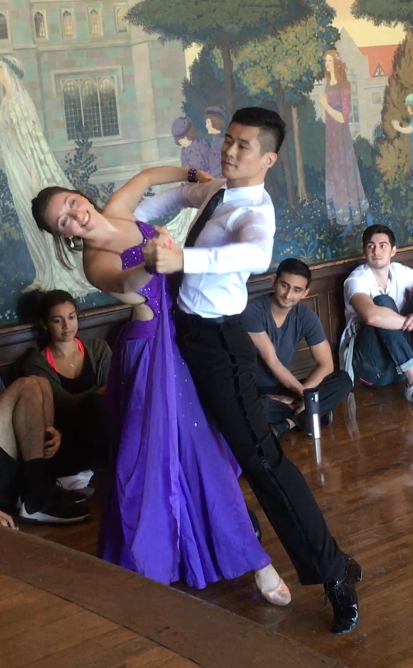

# hw01
This is Ilana Ventura's homework

### First task:
This is a line from RStudio!

### Second task: The Bio
Hi!  My name is Ilana and I am a 1st year Sociology doctoral student.  Here is a bit about me:
* I grew up on Long Island, New York
* Education:
  + Undergrad at Amherst College
  + MA at UChicago, through  MAPSS 
* Before starting my PhD, I worked at NORC at the University of Chicago.
* My hobby is ballroom dancing, which I have been doing for almost **nine years**!
  + My dance partner, Shu, is also in this class!
  + Here is a photo of us from a performance this weekend:

  

### Third Task: Reflection 

Within my assignment, I used section headers, bolding, bullet points for a list and sub items, as well as an imbedded image.  I learned that asterisks make an unordered list, plus signs make a sub-list and two asterisks make bold. The most difficult part was embeding the image into the README Markdown document.  Once I figured out that the image file needed to be saved in my “myrepo\Wk1” folder, however, I got the image to successfully embed. 

