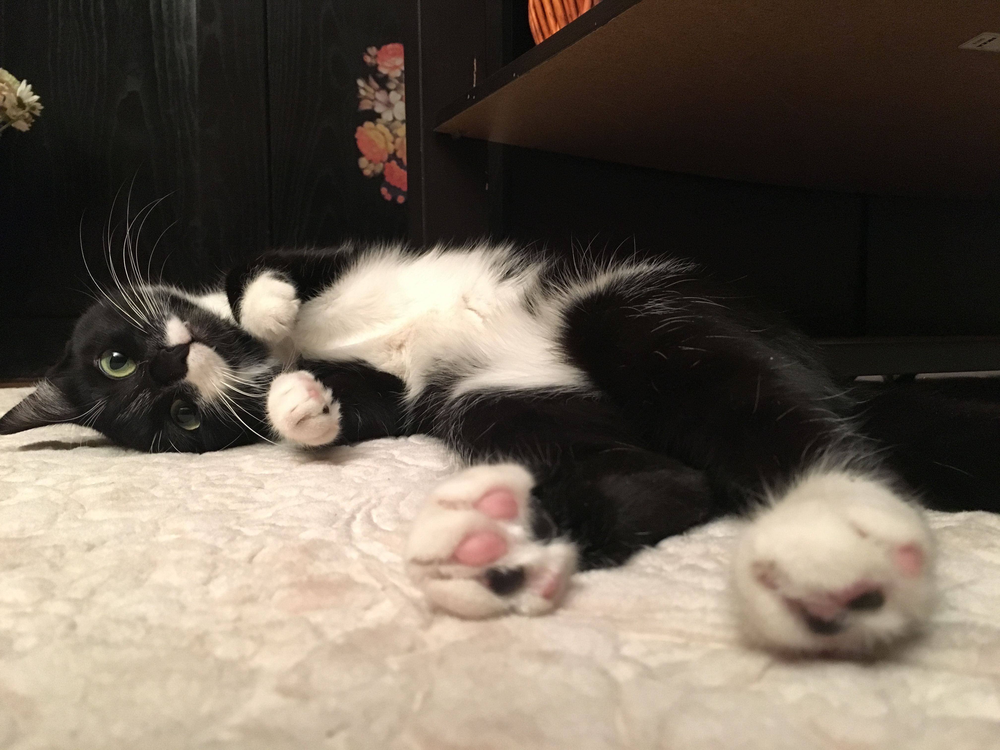

# Introduction by Miray Palaz
Hello dear classmates! My name is Miray Palaz. (pronounced *MEE-ry puh-LAHZ*) I am a 24-year-old woman from Turkey. I received my bachelor's degree at Bogazici University in Istanbul. I studied Political Science and Sociology there. Here at UChicago, I am a MAPSS student with a concentration on Sociology. I am hoping to work with big data and its effects on the society in the future, therefore I am taking this class.  
Here's a list of few things I enjoy outside of school:  
1. Animals, especially cats!  
2. Hanging out at coffee shops  
3. Desserts of all kinds  
4. Art films  
5. Novels  
Finally, here's a picture of my lovely princess cat, Leyla (it means **dark night** in Persian):  

I'm eager to learn many things all together with you this quarter. If you want to connect with me, feel free to add me on [Facebook.](https://www.facebook.com/miray.palaz.71) Good luck to everyone!